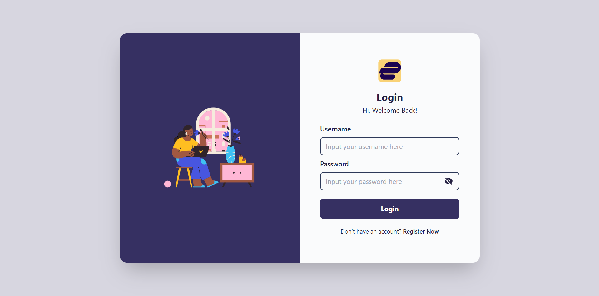
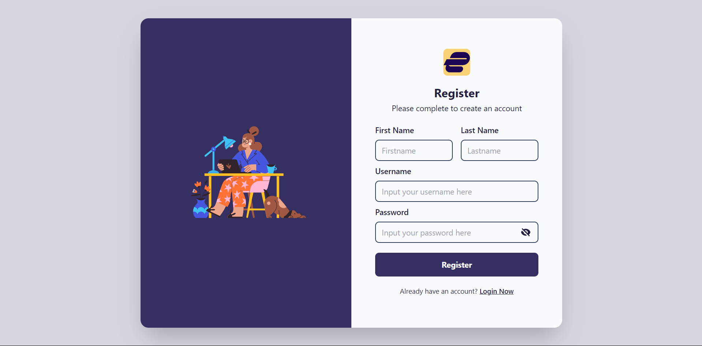

# UI/UX Design Implementation with ReactJS and TailwindCSS

This project is an implementation of a UI/UX design using React, Vite, and Tailwind. It includes registration, login, and profile pages.

## Design
[Figma Design](https://www.figma.com/file/Pck6CH3WjHJigsytPvUrRr/Tugas-UI%2FUX-Sabina?type=design&t=zaLL2xMSRyXIcs8h-6)

## Screenshots
### Login Page

### Registration Page

### Profile Page
